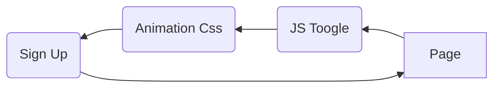
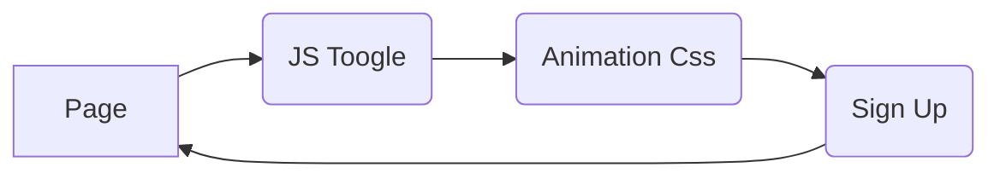

# HTML/CSS - Sign In/Up Form
[Demostração](https://sign-form-eta.vercel.app/)

Olá! Esse é um simples formulário de registro e login 100% responsivo com Animations Css.

## Type Files

Estrutura básica da Web em HTML/CSS e JS.

|TECH	         |VERSION						 |PERCENT        |
|----------------|-------------------------------|---------------|
|HTLML			 |`"5"				`            |35.9%            |
|CSS	         |`"3"`				             |60.7%            |
|Javascript      |`"ES6"`						 |3.4%			 |

## Ilustrações

Todas as ilustrações são fonte de [http://undraw.co/](http://undraw.co/)

## Animations Css

Métodos de animação / [Animation CSS](https://developer.mozilla.org/pt-BR/docs/Web/CSS/animation).  Segue um exemplo em diagrama:

#### Sign In Form Animation Toggle:

#### Sign Up Form Animation Toggle:

# licence
* MIT
